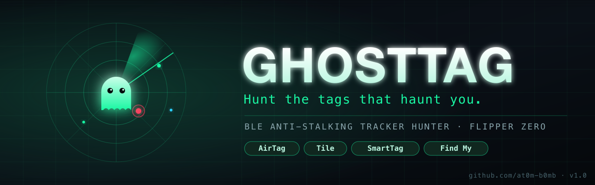
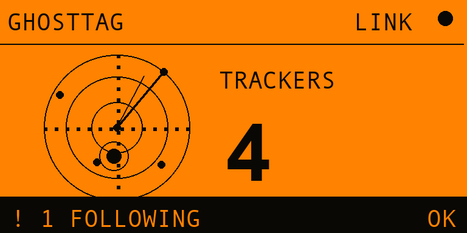
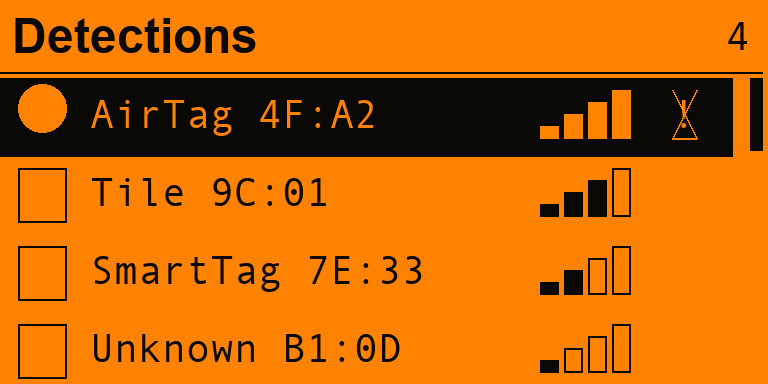
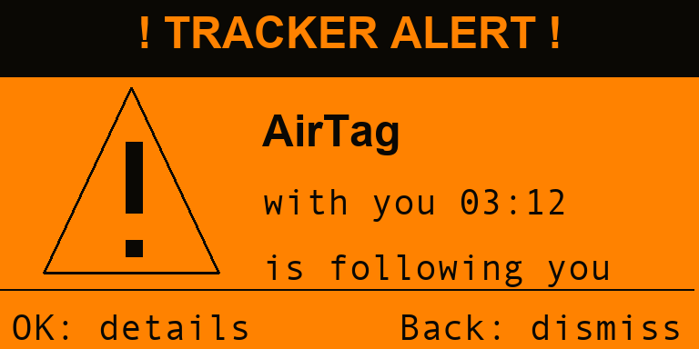
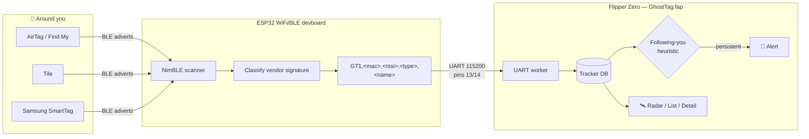

<!-- banner -->
<p align="center">
  
</p>

<h1 align="center">GhostTag 👻</h1>
<p align="center"><i>Hunt the tags that haunt you.</i></p>

<p align="center">
  <a href="https://github.com/at0m-b0mb/GhostTag-FlipperZero/actions/workflows/build.yml"></a>
</p>

<p align="center">
  
  
  
  
</p>

<p align="center">
  <b>GhostTag</b> turns your Flipper Zero into a personal <b>anti-stalking radar</b>. It sniffs out unknown
  Bluetooth trackers — <b>Apple AirTags / Find My</b>, <b>Tile</b> and <b>Samsung SmartTags</b> — and warns you
  when one has been quietly <b>travelling with you</b>.
</p>

---

## 📟 On the Flipper

<p align="center">
  
  &nbsp;
  
  &nbsp;
  
</p>
<p align="center">
  <sub><b>Live radar</b> with sweep + blips &nbsp;·&nbsp; <b>Detections</b> with type, signal & follower flag &nbsp;·&nbsp; <b>Threat alert</b> when something tails you</sub>
</p>

---

## ✨ Features

- 🛰️ **Live radar UI** — animated sweep, range rings and signal-mapped blips. Followers pulse red.
- 🏷️ **Multi-vendor detection** — Apple Find My / AirTag, Tile, Samsung SmartTag (Chipolo ONE Spot rides Find My).
- 🚶 **"Is it following me?" engine** — flags a tag only after it has stayed with you across time *and* repeated sightings, not a one-off passer-by.
- 🚨 **Loud, configurable alerts** — sound, vibration and red LED, individually toggleable.
- 📊 **Per-device detail** — MAC, live RSSI with bars, time-tracked, sighting count, follow status.
- 🎚️ **Tunable** — detection range (Near / Medium / Far) and dwell time before an alert (1–10 min).
- 🔌 **Clean ESP32 protocol** — simple, debuggable UART line protocol; the Flipper is the brain, the ESP32 is the radio.
- 🕶️ **Privacy-first** — everything runs locally on your hardware. No cloud, no accounts, no logging home.

---

## 🧠 How it works

The Flipper Zero's **stock BLE stack is advertising/peripheral-only** — it physically *cannot* scan for other
devices' advertisements ([furi_hal_bt docs](https://developer.flipper.net/flipperzero/doxygen/furi__hal__bt_8h.html)).
So GhostTag splits the job: the **ESP32 companion is the BLE radio**, and the **Flipper is the brain + UI**.



**The follow heuristic.** Trackers rotate their MAC address, so GhostTag treats *persistence* as the signal:
a record is promoted to **FOLLOWING** only once it is a known tracker type, has been seen at least a few times,
**and** has stayed in range for the whole dwell window you configured. That mirrors how AirGuard / Apple's own
Tracker Detect reason about stalking without GPS.

---

## 🧰 Hardware you need

| Item | Notes |
|---|---|
| **Flipper Zero** | Any unit, OFW or a custom firmware (Momentum / Unleashed / RogueMaster). |
| **ESP32 BLE board** | The official [Flipper WiFi Devboard](https://flipper.net/products/wifi-devboard) (ESP32-S2) — plug-and-play — **or** any generic ESP32 wired to the GPIO (see below). |

> [!IMPORTANT]
> The ESP32 board is **required**. Internal Bluetooth alone can broadcast but cannot scan, so it can't see
> trackers. If a future custom firmware ever exposes BLE observer mode, GhostTag's radio source is abstracted
> (`helpers/uart_link.c`) and a native backend can drop straight in.

### Wiring (only for a *generic* ESP32 — the official devboard just clips on)

| Flipper GPIO | → | ESP32 |
|---|---|---|
| `13` TX | → | RX |
| `14` RX | → | TX |
| `9` 3V3 | → | 3V3 |
| `11` GND | → | GND |

> Note the **TX ↔ RX cross-over**. The official devboard handles all of this for you.

---

## 🚀 Installation

### Part 1 — Flash the ESP32 (the radio)

1. Install the **Arduino IDE** and the **ESP32 board package** (`esp32 by Espressif`).
2. In **Library Manager**, install **`NimBLE-Arduino`** (tested on **1.4.x**).
3. Open [`esp32/ghosttag_esp32/ghosttag_esp32.ino`](esp32/ghosttag_esp32/ghosttag_esp32.ino).
4. Select your board:
   - Official Flipper WiFi Devboard → **ESP32S2 Dev Module** (hold **BOOT** while plugging in to enter flash mode).
   - Generic ESP32 → its matching board profile.
5. **Upload.** On boot it prints `GTHELLO,1.0` and starts scanning at `115200` baud.

### Part 2 — Install the Flipper app (the brain)

**Option A — build it yourself (recommended)**

```bash
# one-time: install the micro Flipper build tool
python3 -m pip install --upgrade ufbt

git clone https://github.com/at0m-b0mb/GhostTag-FlipperZero.git
cd GhostTag-FlipperZero

ufbt              # builds dist/ghosttag.fap
ufbt launch       # build + upload to a connected Flipper + run it
```

**Option B — drag-and-drop**

1. Grab `ghosttag.fap` from the [Releases](https://github.com/at0m-b0mb/GhostTag-FlipperZero/releases) page.
2. With [qFlipper](https://flipper.net/update), copy it to `SD Card / apps / Bluetooth /`.

---

## 🎯 Usage

1. Attach + power the ESP32 board, then on the Flipper open **Apps → Bluetooth → GhostTag**.
2. Choose **Hunt (Scan)**. The header shows **LINK** once the ESP32 is talking.
3. **Walk around for a few minutes.** Anything broadcasting nearby appears as a radar blip and in **Detections**.
4. If a tracker stays with you past the **Alert after** dwell time, GhostTag throws a full-screen **TRACKER ALERT**
   with sound / vibration / LED.
5. Press **OK** on the radar (or open **Detections**) to inspect any tag: vendor, MAC, signal, and how long it's
   been tailing you.

### Settings

| Setting | Options | What it does |
|---|---|---|
| **Range** | Near · Medium · Far | RSSI cutoff — *Near* ignores distant tags, *Far* catches everything. |
| **Alert after** | 1 / 3 / 5 / 10 min | How long a tag must stay with you before it's called a follower. |
| **Sound / Vibrate / LED** | On · Off | Which alert channels fire. |

---

## 🔬 Detection signatures

The ESP32 classifies each advertisement and sends a one-digit type code. (Reference: `helpers/ble_signatures.h`.)

| Tracker | BLE signature | Type code |
|---|---|:--:|
| Apple Find My / AirTag | Manufacturer data, company `0x004C`, payload type `0x12` | `1` |
| Apple (nearby/owner) | company `0x004C`, payload type `0x07` | `2` |
| Tile | 16-bit service UUID / service data `0xFEED` | `3` |
| Samsung SmartTag | service data UUID `0xFD5A` / company `0x0075` | `4` |
| Chipolo ONE Spot | rides Apple Find My (`0x12`) | `1` |

### UART line protocol

```
ESP32  → Flipper :  GT1,<mac12hex>,<rssi>,<typecode>,<name>\n
                    GTHELLO,<version>\n           (on boot)
Flipper → ESP32  :  START\n   STOP\n   PING\n
```

Plain ASCII on purpose — you can sniff it with any serial monitor while debugging.

---

## ⚠️ Limitations (honest notes)

- **Rotating MACs.** Find My devices rotate their address (~every 15 min), so a long stalk may appear as several
  short-lived records. GhostTag still catches active separated AirTags because they advertise persistently.
- **No GPS.** Without location, "following" is inferred from time-in-range, not from matching your route. Walk a
  bit and re-check to confirm.
- **Owner devices.** A nearby Apple device in *paired* mode (`0x07`) is usually its owner — it is **not** flagged
  as a threat by default.
- **Range.** BLE reach depends on the ESP32 antenna and surroundings (typically ~10–30 m line of sight).

---

## 🗺️ Roadmap

- [ ] Persist a session log to the SD card
- [ ] "Make it chirp" helper for separated AirTags (sound-trigger lookup)
- [ ] GPS devboard support to confirm a follower across real movement
- [ ] Native internal-BT backend if/when a firmware exposes BLE observer mode

---

## 🛡️ Responsible use

GhostTag is a **defensive, anti-stalking privacy tool**. Use it to detect trackers placed on **you** or your
property, or with the consent of the people involved. Do not use it to harass, surveil, or interfere with others.
You are responsible for complying with the laws in your jurisdiction.

---

## 🙏 Credits & references

- Flipper Zero firmware & [developer docs](https://developer.flipper.net/)
- [NimBLE-Arduino](https://github.com/h2zero/NimBLE-Arduino)
- Prior art that informed the approach: [ESP32-AirTag-Scanner](https://github.com/MatthewKuKanich/ESP32-AirTag-Scanner),
  [Ghost ESP](https://github.com/justcallmekoko/ESP32Marauder), [Wendigo](https://github.com/chris-bc/wendigo)

---

## 📄 License

[MIT](LICENSE) © [at0m-b0mb](https://github.com/at0m-b0mb)

<p align="center"><sub>Built for hackers who'd rather know when they're being followed. 👻</sub></p>
